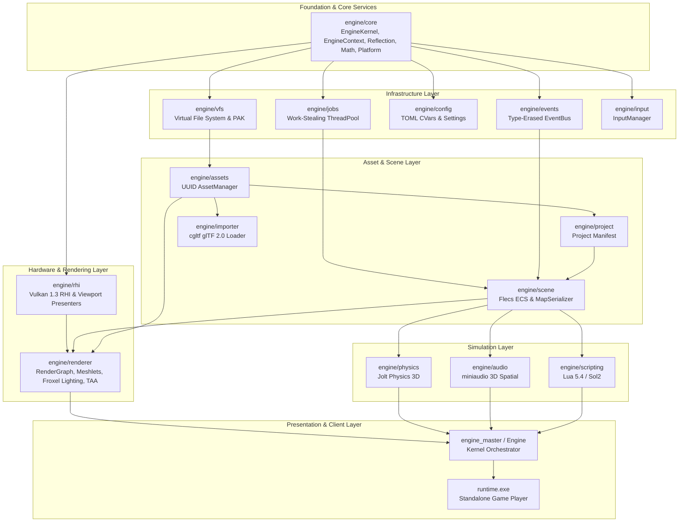

# Architecture & System Design

The **Modern Game Engine** is architected as a modular, high-throughput runtime library compiled as static libraries (`engine_core.lib`, `engine_rhi.lib`, `engine_renderer.lib`, ..., unified as `engine_master.lib`) consumed by the standalone client runtime (`runtime.exe`).

---

## 1. High-Level Dependency Graph (DAG)

The engine strictly enforces a Directed Acyclic Graph (DAG) flow to prevent circular linkage and guarantee deterministic initialization and reverse-order shutdown:

---

## 2. Core Architectural Subsystem Seams

### 2.1. Declarative Subsystem Kernel (`EngineKernel`)
* Subsystems implement the `ISubsystem` interface and declare their dependencies via `SubsystemDependencyBuilder` (e.g. `requires<RhiSubsystem>()`).
* `EngineKernel` uses Kahn's algorithm for topological sorting to guarantee that subsystems initialize in exact dependency order and shut down in reverse order.
* Frames are orchestrated across 5 deterministic execution phases:
  1. `ExecutionPhase::PreTick`: Platform events, window messaging, and input polling.
  2. `ExecutionPhase::Simulation`: Fixed-timestep physics simulation, Flecs scene simulation (`flecs::world::progress`), and Lua controller updates.
  3. `ExecutionPhase::PostSimulation`: Hierarchy propagation, audio emitter synchronization, and camera/frustum extraction.
  4. `ExecutionPhase::Render`: Scene extraction, RenderGraph pass scheduling, and GPU command buffer recording.
  5. `ExecutionPhase::Present`: Frame submission to `IViewportPresenter` and GPU fence synchronization.

### 2.2. Viewport Presentation Seam (`IViewportPresenter`)
* Decouples the engine frame loop from physical OS desktop windows.
* **`WindowSwapchainPresenter`**: Manages SDL3 window handles and Vulkan swapchain presentation for standalone gameplay.
* **`HeadlessPresenter`**: Skips window and swapchain creation, enabling deterministic simulation tests in headless CI/CD pipelines.

### 2.3. Universal Compile-Time Reflection (`TypeRegistry`)
* Lightweight macro-driven metadata registry (`REFLECT_STRUCT_BEGIN`, `REFLECT_FIELD`, `REFLECT_STRUCT_END`).
* `MapSerializer` acts as a generic TOML schema visitor, automatically reading and writing all reflected fields to eliminate manual per-component serialization boilerplate and prevent data loss.

### 2.4. Data-Oriented Design (DOD) & Archetype ECS
* **Flecs 4.1.6**: Entities are lightweight numeric IDs. Components are packed in contiguous archetype tables.
* Systems iterate over contiguous component arrays, maximizing CPU L1/L2 cache locality.

### 2.5. Modern Vulkan 1.3 RHI & GPU-Driven Rendering
* **Vulkan 1.3 Dynamic Rendering (`VK_KHR_dynamic_rendering`)**: No legacy `VkRenderPass` or `VkFramebuffer` objects.
* **Synchronization2 (`VK_KHR_synchronization2`)**: Explicit pipeline barriers, layout transitions, and 64-bit stage masks.
* **Bindless Resource Architecture**: A unified descriptor heap (`16,384` sampled images, `16,384` storage buffers, `256` samplers) accessed via bindless resource indices.
* **Directed Acyclic Graph (DAG) RenderGraph**: Passes register read/write dependencies; the graph calculates barrier transitions and transient memory aliasing.
