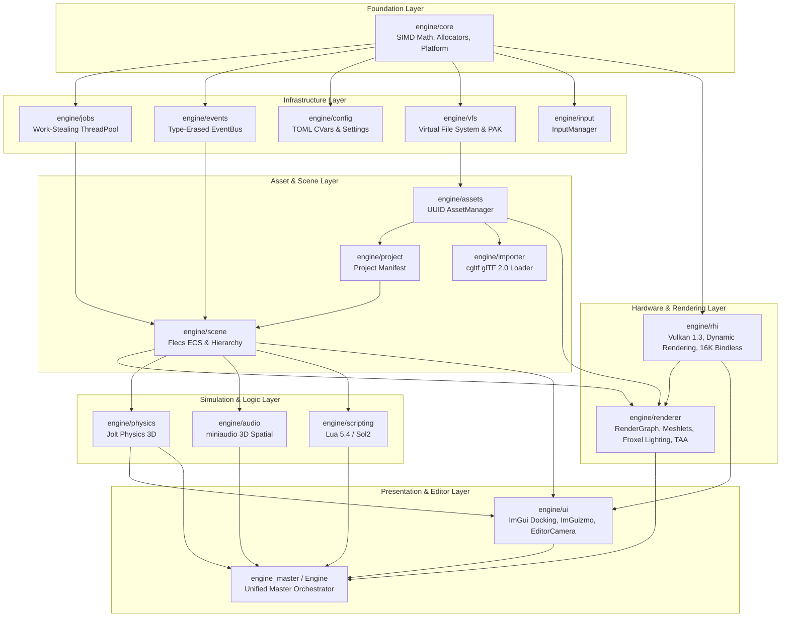

# Architecture & System Design

The **Modern Game Engine** is architected as a modular, high-throughput runtime library compiled as static libraries (`engine_core.lib`, `engine_rhi.lib`, `engine_renderer.lib`, ..., unified as `engine_master.lib`) consumed by applications such as `sandbox.exe` and `editor.exe`.

---

## 1. High-Level Dependency Graph (DAG)

The engine follows a strict acyclic dependency flow to prevent circular linkage and ensure deterministic initialization/shutdown:

---

## 2. Core Architectural Principles

### 2.1. Data-Oriented Design (DOD) & Archetype ECS
* **Flecs 4.1.6**: Entities are lightweight numeric IDs. Components are packed in cache-dense contiguous archetype tables.
* **Component Synchronization**: Systems iterate over component arrays using SIMD instruction sets, avoiding pointer-chasing and cache misses.

### 2.2. Modern Vulkan 1.3 RHI & GPU-Driven Rendering
* **Vulkan 1.3 Dynamic Rendering (`VK_KHR_dynamic_rendering`)**: No legacy `VkRenderPass` or `VkFramebuffer` boilerplate. Color and depth attachments are declared dynamically per-pass.
* **Synchronization2 (`VK_KHR_synchronization2`)**: Explicit pipeline barriers, layout transitions, and stage masks.
* **Bindless Resource Architecture**: A unified descriptor heap (`16,384` sampled images, `16,384` storage buffers, `256` samplers) accessed via 64-bit GPU buffer device addresses (BDA) and bindless texture IDs.
* **Directed Acyclic Graph (DAG) RenderGraph**: Passes register read/write resource dependencies. The RenderGraph automatically computes optimal barrier placement and memory aliasing before recording command buffers.

### 2.3. Multi-Threading & Work-Stealing Job System
* Engine tasks (mesh loading, texture decoding, culling, animation, sound streaming) are split into atomic jobs distributed across an $N$-thread worker pool with thread-local work-stealing ring buffers.

### 2.4. Memory Safety & Leak Detection
* Custom linear, stack, pool, and global heap allocators with 16-byte SIMD alignment and allocation tracking.
* `GlobalAllocator::instance().dump_leaks()` verifies complete deallocation on shutdown.
