# Modern Game Engine — Component DAG & Build Order (v5)

A ground-up modern game engine built with **C++23**, **Vulkan 1.3**, **SDL3**, compiled with **clang-cl + Ninja** via **CMake**, dependencies managed by **vcpkg**.

## Resolved Decisions

| Decision | Choice |
|:---------|:-------|
| Math library | **Custom SIMD** (SSE4.2 / AVX2 / NEON) |
| Build system | **CMake** + **clang-cl** + **Ninja** |
| Dependencies | **vcpkg** (manifest mode) |
| Render architecture | **Render Graph** with async compute, ray tracing, OIT, visibility buffer |
| ECS | **Flecs** (archetype-based, MIT licensed) |
| Physics | **Jolt Physics** |
| Platform layer | **Thin abstraction over SDL3** |
| DCC interchange | **glTF 2.0** primary (cgltf), **USD** future secondary |
| Project format | **TOML** manifest + UUID-based asset references |
| Map format | **TOML** (editor) / **binary** (runtime), prefab system, streaming chunks |
| Verification | **Runnable demos** per phase, no unit tests |

---

## Component Dependency Graph

```mermaid
graph TD
    %% ── Phase 0: Foundation ───────────────────────────────────
    PLATFORM["🧱 Platform<br/><i>SDL3 window, events,<br/>timers</i>"]
    MATH["📐 Math<br/><i>Custom SIMD vec/mat/quat,<br/>AABB, frustum</i>"]
    MEMORY["🧠 Memory<br/><i>linear/stack/pool<br/>allocators, arena</i>"]
    LOG["📝 Logging<br/><i>sinks, levels,<br/>structured output</i>"]
    CONTAINERS["📦 Containers<br/><i>robin-map, slot-map,<br/>handle table</i>"]

    %% ── Phase 1: Infrastructure ───────────────────────────────
    JOBSYS["⚡ Job System<br/><i>fiber tasks,<br/>work stealing</i>"]
    EVENT["📡 Event Bus<br/><i>typed pub/sub,<br/>deferred dispatch</i>"]
    CONFIG["⚙️ Config & CVars<br/><i>TOML config,<br/>runtime tweakables</i>"]

    %% ── Phase 2: File I/O ─────────────────────────────────────
    VFS["💾 Virtual File System<br/><i>mount points, async I/O,<br/>pak archives</i>"]

    %% ── Phase 3: Assets & Hardware ────────────────────────────
    RHI["🎨 RHI<br/><i>Vulkan 1.3 + RT + mesh shaders<br/>+ VRS + HDR swapchain</i>"]
    ASSET["📁 Asset System<br/><i>UUID registry, .meta files,<br/>async load, hot-reload</i>"]
    IMPORTER["📥 Asset Importer<br/><i>glTF 2.0 (cgltf),<br/>schema mapper</i>"]
    INPUT["🎮 Input System<br/><i>action mapping,<br/>rebinding, contexts</i>"]
    PROJECT["📂 Project System<br/><i>project.toml manifest,<br/>asset discovery, cook</i>"]

    %% ── Phase 4: GPU Resources ────────────────────────────────
    SHADER["🔮 Shader System<br/><i>SPIR-V, reflection,<br/>variants, cache</i>"]
    TEXTURE["🖼️ Texture Manager<br/><i>streaming, compression,<br/>bindless</i>"]
    BUFFER["📊 Buffer Manager<br/><i>GPU pools, staging,<br/>upload rings</i>"]

    %% ── Phase 5: Pipeline ─────────────────────────────────────
    MESH["🔺 Mesh System<br/><i>vertex formats, LOD,<br/>meshlets</i>"]
    MATERIAL["🎭 Material System<br/><i>PBR, instances,<br/>descriptors</i>"]
    RENDERGRAPH["📈 Render Graph<br/><i>frame DAG, barriers,<br/>async compute, RT/OIT</i>"]
    CAMERA["📷 Camera<br/><i>projection, view,<br/>frustum, jitter (TAA)</i>"]

    %% ── Phase 6: Scene ────────────────────────────────────────
    SCENE["🌍 ECS (Flecs)<br/><i>archetypes, queries,<br/>reflection, prefabs</i>"]
    SPATIAL["🗺️ Spatial Index<br/><i>BVH, octree,<br/>frustum cull</i>"]

    %% ── Phase 7: Scene (cont.) ───────────────────────────────
    TRANSFORM["🔄 Transforms<br/><i>hierarchy, dirty flags,<br/>world-space cache</i>"]
    MAP["🗺️ Map System<br/><i>scene serialization,<br/>prefabs, streaming</i>"]

    %% ── Phase 8: Renderer ─────────────────────────────────────
    RENDERER["🖥️ Renderer<br/><i>batching, instancing,<br/>visibility buffer, OIT</i>"]
    GPUDRIVEN["⚙️ GPU-Driven Pipeline<br/><i>compute culling, indirect dispatch,<br/>meshlet LOD, instance compaction</i>"]

    %% ── Phase 9: Lighting & Shadows ───────────────────────────
    LIGHTING["💡 Lighting<br/><i>clustered/froxel assignment,<br/>area lights, probes, IBL</i>"]
    VSM["🌑 Virtual Shadow Maps<br/><i>clipmap pages, cached atlas,<br/>nanite-aware</i>"]
    VOLUMETRICS["🌫️ Volumetrics<br/><i>froxel fog, scattering,<br/>light shafts, aerial perspective</i>"]
    GI["🌈 Global Illumination<br/><i>DDGI probes, SSGI,<br/>hybrid RT+screen-space</i>"]
    RTDENOISE["🔇 RT Denoising<br/><i>ReSTIR (DI + GI),<br/>NRD spatial-temporal filters</i>"]
    SKYATMO["🌤️ Sky & Atmosphere<br/><i>LUT-based scattering,<br/>day/night cycle</i>"]

    %% ── Phase 10: Effects ─────────────────────────────────────
    POSTFX["✨ Post-FX<br/><i>bloom, TAA, tonemap,<br/>DoF, motion blur, SSAO, SSR</i>"]
    UPSCALING["🔍 Temporal Upscaling<br/><i>DLSS (Streamline), FSR 3,<br/>XeSS, frame generation</i>"]
    PARTICLES["🎆 Particles<br/><i>GPU compute,<br/>emitters, forces</i>"]
    ANIMATION["🏃 Animation<br/><i>skeletal, blend trees,<br/>IK, state machines</i>"]
    TERRAIN["⛰️ Terrain<br/><i>clipmap LOD,<br/>virtual texture</i>"]

    %% ── Phase 11: Simulation ──────────────────────────────────
    PHYSICS["⚛️ Physics (Jolt)<br/><i>rigid body, collision,<br/>raycasting</i>"]
    AUDIO["🔊 Audio<br/><i>3D spatial, mixing,<br/>streaming</i>"]

    %% ── Phase 12: Gameplay ────────────────────────────────────
    SCRIPT["📜 Scripting<br/><i>Lua, hot-reload,<br/>bindings</i>"]
    UI["🖼️ UI System<br/><i>retained-mode, layouts,<br/>text rendering</i>"]
    NAVMESH["🧭 Navigation<br/><i>navmesh, pathfinding,<br/>steering</i>"]

    %% ── Phase 13–14: Tools ────────────────────────────────────
    DEBUG["🐛 Debug Overlay<br/><i>ImGui, profiler,<br/>gizmos</i>"]
    EDITOR["🛠️ Editor<br/><i>scene editing, inspector,<br/>asset browser</i>"]

    %% ══════════════════════════════════════════════════════════
    %% EDGES
    %% ══════════════════════════════════════════════════════════

    %% Phase 0 → 1
    PLATFORM --> JOBSYS
    MEMORY --> JOBSYS
    LOG --> JOBSYS
    CONTAINERS --> JOBSYS

    PLATFORM --> EVENT
    MEMORY --> EVENT
    LOG --> EVENT

    LOG --> CONFIG
    MEMORY --> CONFIG
    CONTAINERS --> CONFIG

    %% Phase 1 → 2
    PLATFORM --> VFS
    MEMORY --> VFS
    LOG --> VFS
    JOBSYS --> VFS

    %% Phase 2 → 3
    PLATFORM --> RHI
    MEMORY --> RHI
    LOG --> RHI
    MATH --> RHI
    CONTAINERS --> RHI

    VFS --> ASSET
    JOBSYS --> ASSET
    LOG --> ASSET
    MEMORY --> ASSET
    CONTAINERS --> ASSET
    EVENT --> ASSET

    ASSET --> IMPORTER
    VFS --> IMPORTER
    MATH --> IMPORTER
    LOG --> IMPORTER
    MEMORY --> IMPORTER

    PLATFORM --> INPUT
    EVENT --> INPUT
    CONFIG --> INPUT
    LOG --> INPUT

    VFS --> PROJECT
    CONFIG --> PROJECT
    ASSET --> PROJECT
    LOG --> PROJECT

    %% Phase 3 → 4
    RHI --> SHADER
    VFS --> SHADER
    ASSET --> SHADER
    LOG --> SHADER

    RHI --> TEXTURE
    ASSET --> TEXTURE
    MEMORY --> TEXTURE
    JOBSYS --> TEXTURE
    LOG --> TEXTURE

    RHI --> BUFFER
    MEMORY --> BUFFER
    LOG --> BUFFER

    %% Phase 4 → 5
    ASSET --> MESH
    BUFFER --> MESH
    MATH --> MESH
    LOG --> MESH
    IMPORTER --> MESH

    SHADER --> MATERIAL
    TEXTURE --> MATERIAL
    BUFFER --> MATERIAL
    LOG --> MATERIAL
    IMPORTER --> MATERIAL

    RHI --> RENDERGRAPH
    MEMORY --> RENDERGRAPH
    JOBSYS --> RENDERGRAPH
    LOG --> RENDERGRAPH

    MATH --> CAMERA
    CONFIG --> CAMERA
    LOG --> CAMERA

    %% Phase 5 → 6
    MEMORY --> SCENE
    CONTAINERS --> SCENE
    MATH --> SCENE
    EVENT --> SCENE
    JOBSYS --> SCENE
    LOG --> SCENE

    MATH --> SPATIAL
    MEMORY --> SPATIAL
    CONTAINERS --> SPATIAL
    JOBSYS --> SPATIAL

    %% Phase 6 → 7
    SCENE --> TRANSFORM
    MATH --> TRANSFORM
    JOBSYS --> TRANSFORM

    SCENE --> MAP
    ASSET --> MAP
    VFS --> MAP
    PROJECT --> MAP
    MATH --> MAP
    JOBSYS --> MAP
    IMPORTER --> MAP

    %% Phase 7 → 8
    RENDERGRAPH --> RENDERER
    MATERIAL --> RENDERER
    MESH --> RENDERER
    CAMERA --> RENDERER
    SPATIAL --> RENDERER
    TRANSFORM --> RENDERER
    SCENE --> RENDERER
    JOBSYS --> RENDERER

    RENDERER --> GPUDRIVEN
    MESH --> GPUDRIVEN
    BUFFER --> GPUDRIVEN
    SPATIAL --> GPUDRIVEN
    SHADER --> GPUDRIVEN
    RHI --> GPUDRIVEN
    CAMERA --> GPUDRIVEN

    %% Phase 8 → 9
    RENDERER --> LIGHTING
    SHADER --> LIGHTING
    SPATIAL --> LIGHTING
    CAMERA --> LIGHTING
    MATH --> LIGHTING
    SCENE --> LIGHTING
    BUFFER --> LIGHTING

    LIGHTING --> VSM
    RENDERER --> VSM
    GPUDRIVEN --> VSM
    TEXTURE --> VSM
    BUFFER --> VSM
    SHADER --> VSM
    CAMERA --> VSM

    RENDERER --> VOLUMETRICS
    LIGHTING --> VOLUMETRICS
    SHADER --> VOLUMETRICS
    CAMERA --> VOLUMETRICS
    BUFFER --> VOLUMETRICS
    MATH --> VOLUMETRICS

    RENDERER --> GI
    LIGHTING --> GI
    SPATIAL --> GI
    SHADER --> GI
    RHI --> GI
    CAMERA --> GI
    BUFFER --> GI
    MATH --> GI

    RENDERER --> RTDENOISE
    RHI --> RTDENOISE
    SHADER --> RTDENOISE
    CAMERA --> RTDENOISE
    BUFFER --> RTDENOISE
    GI --> RTDENOISE

    RENDERER --> SKYATMO
    SHADER --> SKYATMO
    CAMERA --> SKYATMO
    MATH --> SKYATMO

    %% Phase 9 → 10
    RENDERER --> POSTFX
    RENDERGRAPH --> POSTFX
    SHADER --> POSTFX
    CAMERA --> POSTFX

    POSTFX --> UPSCALING
    RENDERER --> UPSCALING
    RHI --> UPSCALING
    CAMERA --> UPSCALING
    BUFFER --> UPSCALING

    RENDERER --> PARTICLES
    BUFFER --> PARTICLES
    MATH --> PARTICLES
    JOBSYS --> PARTICLES
    SHADER --> PARTICLES

    SCENE --> ANIMATION
    MESH --> ANIMATION
    MATH --> ANIMATION
    JOBSYS --> ANIMATION
    ASSET --> ANIMATION
    IMPORTER --> ANIMATION

    RENDERER --> TERRAIN
    TEXTURE --> TERRAIN
    MESH --> TERRAIN
    SPATIAL --> TERRAIN
    MATH --> TERRAIN
    SHADER --> TERRAIN

    %% Phase 10 → 11
    SCENE --> PHYSICS
    MATH --> PHYSICS
    SPATIAL --> PHYSICS
    TRANSFORM --> PHYSICS
    JOBSYS --> PHYSICS
    EVENT --> PHYSICS

    PLATFORM --> AUDIO
    ASSET --> AUDIO
    MATH --> AUDIO
    SCENE --> AUDIO
    EVENT --> AUDIO
    JOBSYS --> AUDIO

    %% Phase 11 → 12
    SCENE --> SCRIPT
    EVENT --> SCRIPT
    INPUT --> SCRIPT
    VFS --> SCRIPT
    LOG --> SCRIPT
    ASSET --> SCRIPT

    RENDERER --> UI
    INPUT --> UI
    ASSET --> UI
    MATH --> UI
    EVENT --> UI

    SCENE --> NAVMESH
    SPATIAL --> NAVMESH
    PHYSICS --> NAVMESH
    MATH --> NAVMESH
    JOBSYS --> NAVMESH

    %% Phase 12 → 13
    RENDERER --> DEBUG
    UI --> DEBUG
    SCENE --> DEBUG
    INPUT --> DEBUG
    CONFIG --> DEBUG

    %% Phase 13 → 14
    DEBUG --> EDITOR
    SCENE --> EDITOR
    ASSET --> EDITOR
    INPUT --> EDITOR
    UI --> EDITOR
    SCRIPT --> EDITOR
    PHYSICS --> EDITOR
    RENDERER --> EDITOR
    VFS --> EDITOR
    MAP --> EDITOR
    PROJECT --> EDITOR
    IMPORTER --> EDITOR

    %% ── Styling ───────────────────────────────────────────────
    classDef phase0 fill:#1a1a2e,stroke:#e94560,color:#eee
    classDef phase1 fill:#16213e,stroke:#0f3460,color:#eee
    classDef phase2 fill:#0f3460,stroke:#e94560,color:#eee
    classDef phase3 fill:#1a1a2e,stroke:#533483,color:#eee
    classDef phase4 fill:#533483,stroke:#e94560,color:#eee
    classDef phase5 fill:#0f3460,stroke:#533483,color:#eee
    classDef phase6 fill:#1a1a2e,stroke:#0f3460,color:#eee
    classDef phase7 fill:#16213e,stroke:#e94560,color:#eee
    classDef phase8 fill:#533483,stroke:#0f3460,color:#eee
    classDef phase9 fill:#0f3460,stroke:#e94560,color:#eee
    classDef phase10 fill:#1a1a2e,stroke:#533483,color:#eee
    classDef phase11 fill:#16213e,stroke:#533483,color:#eee
    classDef phase12 fill:#533483,stroke:#e94560,color:#eee
    classDef phase13 fill:#e94560,stroke:#1a1a2e,color:#fff

    class PLATFORM,MATH,MEMORY,LOG,CONTAINERS phase0
    class JOBSYS,EVENT,CONFIG phase1
    class VFS phase2
    class RHI,ASSET,INPUT,PROJECT,IMPORTER phase3
    class SHADER,TEXTURE,BUFFER phase4
    class MESH,MATERIAL,RENDERGRAPH,CAMERA phase5
    class SCENE,SPATIAL phase6
    class TRANSFORM,MAP phase7
    class RENDERER,GPUDRIVEN phase8
    class LIGHTING,VSM,VOLUMETRICS,GI,RTDENOISE,SKYATMO phase9
    class POSTFX,UPSCALING,PARTICLES,ANIMATION,TERRAIN phase10
    class PHYSICS,AUDIO phase11
    class SCRIPT,UI,NAVMESH phase12
    class DEBUG,EDITOR phase13
```



---

## Build Order (Topological Sort)

| Phase | Components | Demo Target |
|:-----:|:-----------|:------------|
| **0** | `Platform`, `Math`, `Memory`, `Logging`, `Containers` | SDL3 window, log output |
| **1** | `Job System`, `Event Bus`, `Config/CVars` | Multi-threaded dispatch |
| **2** | `Virtual File System` | Async file load |
| **3** | `RHI`, `Asset System`, `Asset Importer`, `Input`, `Project` | **Vulkan triangle**, mesh shader hello, glTF import |
| **4** | `Shader System`, `Texture Manager`, `Buffer Manager` | Textured quad, hot-reload shaders |
| **5** | `Mesh System`, `Material System`, `Render Graph`, `Camera` | PBR model via render graph + async compute |
| **6** | `ECS (Flecs)`, `Spatial Indexing` | 10k entities, frustum-culled |
| **7** | `Transform System`, `Map System` | Load `.map` → scene with hierarchy |
| **8** | `Renderer`, `GPU-Driven Pipeline` | Visibility buffer, meshlet rendering, compute culling, OIT |
| **9** | `Lighting`, `Virtual Shadow Maps`, `Volumetrics`, `GI`, `RT Denoising`, `Sky` | Full lighting stack: clustered + VSM + DDGI + volumetric fog + ReSTIR |
| **10** | `Post-FX`, `Upscaling`, `Particles`, `Animation`, `Terrain` | Bloom/TAA/SSAO + DLSS/FSR + GPU particles |
| **11** | `Physics (Jolt)`, `Audio` | Rigid bodies, spatial audio |
| **12** | `Scripting`, `UI`, `Navigation / AI` | Lua entity, in-game UI, pathfinding |
| **13** | `Debug Overlay` | ImGui profiler, inspector, gizmos |
| **14** | `Editor` | Full scene editor |

---

## Rendering System — Complete Feature Matrix

### RHI (Phase 3) — Vulkan Capabilities

| Feature | Vulkan Extension | Purpose |
|:--------|:----------------|:--------|
| Dynamic Rendering | Core 1.3 | No `VkRenderPass` objects |
| Synchronization2 | Core 1.3 | Simplified barriers |
| Timeline Semaphores | Core 1.3 | CPU-GPU sync |
| Buffer Device Address | Core 1.3 | Bindless buffer access |
| Descriptor Indexing | Core 1.3 | Bindless textures |
| **Mesh Shaders** | `VK_EXT_mesh_shader` | Meshlet rendering, GPU-driven |
| **Ray Tracing Pipeline** | `VK_KHR_ray_tracing_pipeline` | RT shadows, reflections, GI |
| **Ray Query** | `VK_KHR_ray_query` | Inline RT in any shader stage |
| **Acceleration Structures** | `VK_KHR_acceleration_structure` | BLAS/TLAS management |
| **Variable Rate Shading** | `VK_KHR_fragment_shading_rate` | Adaptive shading rate |
| **HDR Swapchain** | `VK_EXT_swapchain_colorspace` | HDR10 / scRGB output |
| Maintenance4 | Core 1.3 | Various improvements |

### Render Graph (Phase 5) — Scheduling

| Feature | Description |
|:--------|:------------|
| Frame DAG | Declare passes, resources, and dependencies |
| Automatic barriers | `VkPipelineBarrier2` generated from graph analysis |
| Transient resources | Aliased GPU memory for single-frame attachments |
| **Async compute** | Multi-queue scheduling — overlap compute + graphics |
| Pass types | Raster, compute, ray tracing, transfer |
| Resource lifetime | Automatic create / destroy / reuse across frames |

### Renderer (Phase 8) — Draw Paths

| Path | Description |
|:-----|:------------|
| **Forward+** | Traditional vertex-driven rendering, clustered lighting |
| **Visibility Buffer** | Meshlet rasterize → material resolve (deferred materials) |
| **GPU-Driven Indirect** | Compute culling → `vkCmdDrawMeshTasksIndirect` |
| **OIT** | Weighted-blended or per-pixel linked list for transparencies |
| **Ray Tracing** | RT reflections, RT shadows, RT GI via render graph passes |

### GPU-Driven Pipeline (Phase 8)

```
┌─────────────────────────────────────────────────────────┐
│               GPU-Driven Rendering Pipeline              │
│                                                          │
│  CPU (once per frame)                                    │
│  ├── Upload instance transforms to GPU buffer            │
│  ├── Upload meshlet metadata (if changed)                │
│  └── Submit compute + graphics command buffers           │
│                                                          │
│  GPU Compute Pass 1: Instance Culling                    │
│  ├── Frustum cull per instance                           │
│  ├── Occlusion cull (HiZ from previous frame)            │
│  └── Output: visible instance list                       │
│                                                          │
│  GPU Compute Pass 2: Meshlet Culling                     │
│  ├── Per-meshlet frustum + backface + occlusion cull     │
│  ├── LOD selection per meshlet cluster                   │
│  └── Output: indirect draw commands                      │
│                                                          │
│  GPU Raster Pass: Visibility Buffer                      │
│  ├── Mesh shader: emit meshlet triangles                 │
│  ├── Fragment: write visibility (instance + triangle ID) │
│  └── Output: visibility buffer (R32G32_UINT)             │
│                                                          │
│  GPU Compute Pass 3: Material Resolve                    │
│  ├── Read visibility buffer                              │
│  ├── Fetch vertex data, interpolate attributes           │
│  ├── Evaluate material (bindless textures)               │
│  └── Output: GBuffer (albedo, normal, PBR params)        │
│                                                          │
│  → Continue to lighting, shadows, post-fx                │
└─────────────────────────────────────────────────────────┘
```

### Lighting (Phase 9)

| Feature | Technique |
|:--------|:----------|
| Light assignment | **Clustered / Froxel** — 3D frustum grid, O(1) per-pixel light lookup |
| Direct shadows (sun) | **Virtual Shadow Maps** — clipmap pages, 16k+ effective resolution |
| Direct shadows (local) | Shadow atlas (spot) / cube (point) / **RT shadows** (any) |
| Indirect diffuse | **DDGI** — dynamic diffuse probe grid, irradiance + visibility |
| Indirect specular | Reflection probes (baked) + **RT reflections** + SSR fallback |
| Area lights | **LTC** (linearly transformed cosines) for raster, RT for shadows |
| Emissive | HDR emissive surfaces → bloom |
| IBL | Pre-filtered environment map + irradiance SH |

### Virtual Shadow Maps (Phase 9)

```
┌─────────────────────────────────────────────────┐
│           Virtual Shadow Maps                    │
│                                                  │
│  Shadow Atlas (physical pages)                   │
│  ┌────┬────┬────┬────┐                           │
│  │ P0 │ P1 │ P2 │ P3 │  128x128 pages           │
│  ├────┼────┼────┼────┤                           │
│  │ P4 │ P5 │    │    │  Allocated on demand      │
│  └────┴────┴────┴────┘                           │
│       ▲                                          │
│       │ page table lookup                        │
│  ┌────┴─────────────────────┐                    │
│  │  Virtual Page Table       │                    │
│  │  (clipmap levels 0..N)    │                    │
│  │  Marks dirty pages only   │                    │
│  │  GPU caches clean pages   │                    │
│  └──────────────────────────┘                    │
│                                                  │
│  • Only re-render pages where shadow casters move │
│  • 16384²+ effective shadow resolution            │
│  • Integrates with GPU-driven pipeline            │
└─────────────────────────────────────────────────┘
```

### Volumetrics (Phase 9)

| Feature | Technique |
|:--------|:----------|
| Fog volume | **Froxel grid** — 3D texture (160×90×64 typical) |
| Scattering | Physically-based Henyey-Greenstein phase function |
| Light shafts | Volumetric shadow rays through froxel grid |
| Aerial perspective | Atmosphere integration for distant objects |
| Local fog | Box/sphere fog volumes as ECS components |

### Global Illumination (Phase 9)

| Feature | Technique |
|:--------|:----------|
| Diffuse GI | **DDGI** — irradiance probes + visibility, updated via RT |
| Screen-space GI | **SSGI** — screen-space multi-bounce approximation |
| Specular GI | RT reflections (1 spp) + denoiser, SSR fallback |
| Hybrid | RT for accuracy, screen-space for fill, probes for stability |

### RT Denoising (Phase 9)

| Feature | Technique |
|:--------|:----------|
| Sampling | **ReSTIR DI** — reservoir-based direct illumination, many-light |
| Sampling | **ReSTIR GI** — reservoir-based path reuse for indirect |
| Denoising | **NRD** — NVIDIA Real-time Denoisers (ReLAX, ReBLUR, SIGMA) |
| Denoising | Or custom spatiotemporal filter (bilateral + temporal accumulation) |
| Integration | 1 spp RT → ReSTIR resampling → NRD filter → clean output |

### Temporal Upscaling (Phase 10)

| Backend | Integration | Notes |
|:--------|:-----------|:------|
| **DLSS 3.5** | Via NVIDIA Streamline SDK | Ray Reconstruction, Frame Generation |
| **FSR 3** | AMD open-source | Temporal upscaling + frame generation |
| **XeSS** | Intel SDK | Cross-vendor temporal upscaling |
| **Custom TAA-U** | Built-in fallback | Jittered rendering + temporal resolve |

All upscalers receive: color, depth, motion vectors, exposure. Render at lower internal resolution, upscale to display resolution.

### Variable Rate Shading

| Mode | Trigger |
|:-----|:--------|
| Per-draw | Low-detail objects (foliage, particles) at 2×2 or 4×4 |
| Image-based | Motion-based: fast-moving areas at lower rate |
| Image-based | Luminance-based: dark areas at lower rate |
| Foveated | VR: peripheral vision at lower rate |

### HDR Display Output

| Feature | Detail |
|:--------|:-------|
| Swapchain | `VK_COLOR_SPACE_HDR10_ST2084_EXT` or `VK_COLOR_SPACE_EXTENDED_SRGB_LINEAR_EXT` |
| Tonemapping | ACES / AgX / custom, output to PQ (HDR10) or scRGB |
| UI compositing | UI rendered in SDR, composited into HDR framebuffer |
| Fallback | SDR swapchain + standard tonemapping if no HDR display |

---

## Component Details (Phase 0–7 unchanged from v4)

### Phase 0 — Foundation
- **Platform**: thin SDL3 wrapper
- **Math**: custom SIMD (SSE4.2/AVX2/NEON), column-major, right-handed
- **Memory**: linear/stack/pool/free-list allocators, `Allocator*` everywhere
- **Logging**: severity levels, sinks (console/file/ring), compile-time filter
- **Containers**: robin-map, slot-map, handle table, ring buffer, fixed vector

### Phase 1 — Infrastructure
- **Job System**: fiber-based, work stealing
- **Event Bus**: typed pub/sub, deferred dispatch
- **Config/CVars**: TOML, runtime tweakables

### Phase 2 — File I/O
- **VFS**: mount points, async read via jobs, pak archives

### Phase 3 — Hardware, Assets, Import, Project
- **RHI**: Vulkan 1.3 + RT + mesh shaders + VRS + HDR (see table above)
- **Asset System**: UUID-based, hot-reload, async load
- **Asset Importer**: cgltf, schema mapper, glTF → engine-native (see v4 details)
- **Input**: action-based, contexts, rebindable
- **Project**: project.toml, UUID registry, cook pipeline

### Phase 4 — GPU Resources
- **Shaders**: SPIR-V, reflection, variants, pipeline cache
- **Textures**: async streaming, BC7/ASTC, bindless
- **Buffers**: GPU pools, upload ring, BDA

### Phase 5 — Pipeline
- **Mesh**: vertex formats, LOD, meshlets (mesh shader–ready)
- **Material**: PBR + transmission/clearcoat/sheen/IOR/volume, bindless, auto-OIT routing
- **Render Graph**: frame DAG, barriers, async compute, RT/OIT passes
- **Camera**: perspective/ortho, frustum, TAA jitter sequence

### Phase 6–7 — Scene & Maps
- **ECS (Flecs)**: archetype, reflection, prefabs, light components
- **Spatial**: BVH, octree, culling
- **Transforms**: hierarchy, dirty flags
- **Maps**: TOML/binary, prefab diffing, streaming chunks

### Phase 8–14 Summary

| Phase | Component | Key Features |
|:-----:|:----------|:-------------|
| 8 | **Renderer** | Forward+, visibility buffer, OIT |
| 8 | **GPU-Driven Pipeline** | Compute culling, meshlet LOD, indirect dispatch |
| 9 | **Lighting** | Clustered/froxel, area lights (LTC), probes, IBL |
| 9 | **Virtual Shadow Maps** | Clipmap pages, cached atlas, GPU-driven aware |
| 9 | **Volumetrics** | Froxel fog, scattering, light shafts, aerial perspective |
| 9 | **Global Illumination** | DDGI probes, SSGI, hybrid RT+screen-space |
| 9 | **RT Denoising** | ReSTIR DI/GI, NRD spatiotemporal filters |
| 9 | **Sky & Atmosphere** | LUT-based scattering, day/night |
| 10 | **Post-FX** | Bloom, TAA, tonemapping, DoF, motion blur, SSAO, SSR |
| 10 | **Temporal Upscaling** | DLSS 3.5 (Streamline), FSR 3, XeSS, custom fallback |
| 10 | **Particles** | GPU compute, emitters, forces, collision |
| 10 | **Animation** | Skeletal, blend trees, IK, state machines |
| 10 | **Terrain** | Clipmap LOD, virtual texturing, foliage |
| 11 | **Physics** | Jolt: rigid bodies, collision, raycasts |
| 11 | **Audio** | 3D spatialization, streaming, mixer |
| 12 | **Scripting** | Lua (sol2), hot-reload, flecs bindings |
| 12 | **UI** | Retained-mode, layout engine, FreeType text |
| 12 | **Navigation** | Recast/Detour navmesh, A* pathfinding |
| 13 | **Debug** | ImGui overlay, profiler, inspector, gizmos |
| 14 | **Editor** | Scene viewport, hierarchy, inspector, asset browser, map save/load |

---

## Project Structure

```
my-engine/
├── CMakeLists.txt
├── CMakePresets.json
├── vcpkg.json
├── cmake/
│   ├── CompilerFlags.cmake
│   └── Platforms.cmake
├── engine/
│   ├── core/                        # Phase 0
│   ├── jobs/                        # Phase 1
│   ├── events/                      # Phase 1
│   ├── config/                      # Phase 1
│   ├── vfs/                         # Phase 2
│   ├── rhi/                         # Phase 3 (Vulkan + RT + mesh shaders + VRS + HDR)
│   ├── assets/                      # Phase 3
│   ├── importer/                    # Phase 3 (glTF → engine-native)
│   ├── input/                       # Phase 3
│   ├── project/                     # Phase 3
│   ├── render/                      # Phase 4–10
│   │   ├── shaders/                 # Shader system
│   │   ├── textures/                # Texture manager
│   │   ├── buffers/                 # Buffer manager
│   │   ├── mesh/                    # Mesh system + meshlets
│   │   ├── material/                # Material system
│   │   ├── graph/                   # Render graph + async compute
│   │   ├── camera/                  # Camera + jitter
│   │   ├── renderer/                # Forward+, visibility buffer, OIT
│   │   ├── gpu_driven/              # Compute culling, indirect dispatch
│   │   ├── lighting/                # Clustered, area lights, probes, IBL
│   │   ├── shadows/                 # Virtual shadow maps, cascaded, RT
│   │   ├── volumetrics/             # Froxel fog, light shafts
│   │   ├── gi/                      # DDGI, SSGI, hybrid GI
│   │   ├── rt_denoise/              # ReSTIR, NRD
│   │   ├── sky/                     # Atmosphere, day/night
│   │   ├── postfx/                  # Bloom, TAA, tonemap, SSAO, SSR, DoF
│   │   └── upscaling/              # DLSS, FSR, XeSS
│   ├── scene/                       # Phase 6–7 (flecs, spatial, transforms, lights)
│   ├── map/                         # Phase 7
│   ├── physics/                     # Phase 11
│   ├── audio/                       # Phase 11
│   ├── animation/                   # Phase 10
│   ├── particles/                   # Phase 10
│   ├── terrain/                     # Phase 10
│   ├── scripting/                   # Phase 12
│   ├── ui/                          # Phase 12
│   ├── navigation/                  # Phase 12
│   └── debug/                       # Phase 13
├── editor/                          # Phase 14
├── sandbox/
├── tools/
│   └── asset_cooker/
└── third_party/
```

---

## vcpkg Dependencies

```json
{
  "name": "my-engine",
  "version": "0.1.0",
  "dependencies": [
    "sdl3",
    "vulkan-headers",
    "vulkan-memory-allocator",
    "flecs",
    "cgltf",
    "imgui",
    "joltphysics",
    "sol2",
    "lua",
    "tomlplusplus",
    "stb",
    "recastnavigation"
  ]
}
```

> [!NOTE]
> DLSS (Streamline SDK) and NRD are distributed as separate SDKs — vendored in `third_party/`, not in vcpkg.

---

## Verification Plan

| Phase | Demo |
|:-----:|:-----|
| 0 | SDL3 window, log output |
| 3 | Vulkan triangle, mesh shader hello-world, glTF import log |
| 5 | PBR model via render graph, async compute overlap visible in profiler |
| 8 | Visibility buffer rendering, meshlet culling, OIT transparency |
| 9 | Full lighting: clustered + VSM + DDGI + volumetric fog + ReSTIR denoised RT |
| 10 | DLSS/FSR upscaling toggle, GPU particles, animated character |
| 14 | Editor with full rendering pipeline visible in viewport |
